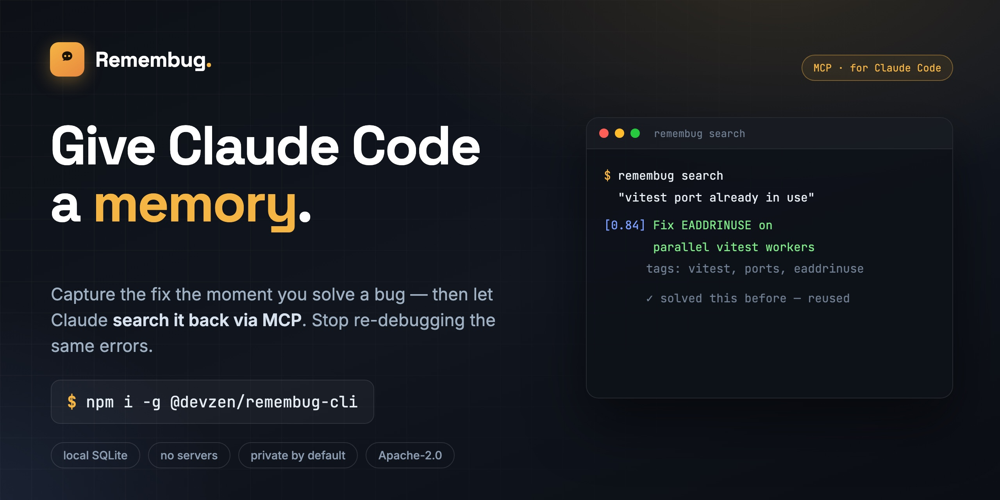

# Remembug — give Claude Code a memory



> **Capture the fix the moment you solve a bug, then let Claude search it back via MCP — so you stop re-debugging the same errors.** A local, MCP-native memory and knowledge base for Claude Code.

[](https://www.npmjs.com/package/@devzen/remembug-cli)
[](https://github.com/zaitanabil/remembug-cli/actions/workflows/ci.yml)
[](LICENSE)
[](.nvmrc)

**Remembug is persistent memory for Claude Code** — an MCP server + local knowledge base that turns the debugging sessions you choose to keep into a searchable, Stack-Overflow-style Q&A Claude can pull from. Local-first, human-reviewed, zero infra.

When you debug something hard with Claude Code, you usually solve it once and then forget the details. Next month, when the same problem hits again, Claude reasons from scratch and you watch the same dance for the third time.

**Remembug captures the moment you fix something** — the failure, what you tried, what worked — and stores it locally as a Q&A entry you can search. It exposes that knowledge back to Claude Code via MCP, so the next time Claude sees a similar error it can pull the answer instead of guessing.

No accounts. No servers. No telemetry. All your data lives in `~/.remembug/remembug.db`.

## Install

```bash
npm install -g @devzen/remembug-cli
remembug init
remembug config set anthropic-key sk-ant-...
remembug daemon start
```

**No API key?** Use a free local model instead — [install Ollama](https://ollama.com), pull a model, and point Remembug at it:

```bash
ollama pull qwen2.5-coder:3b
remembug config set llm.provider ollama
remembug config set llm.model qwen2.5-coder:3b
remembug daemon start
```

Drafting then runs entirely on your machine — no key, no cost, nothing leaves localhost. (A larger instruct/coder model drafts more cleanly; the review step catches the rest.)

That's it. Use Claude Code normally — Remembug watches for failures and resolutions, drafts entries on the side, and queues them for your review.

Nothing showing up? Run `remembug doctor` — it checks every link in the chain (config, API key, daemon, Claude Code hooks, MCP wiring, the store) and prints exactly what to fix:

```
$ remembug doctor
[remembug] doctor

  ✓ Remembug home        /Users/you/.remembug
  ✓ LLM API key          REMEMBUG_ANTHROPIC_KEY is set
  ✗ Daemon               not reachable on port 7842
      ↳ remembug daemon start  (then check ~/.remembug/logs/daemon.log if it stays down)
  ✓ Claude Code hooks    PostToolUse + Stop wired
  ✓ MCP server           registered (restart Claude Code if you just ran init)
  ✓ Knowledge base       12 published, 3 pending review — vector search on

[remembug] 1 problem(s).
```

## 30-second demo

```
$ remembug daemon start
[remembug] daemon listening on http://127.0.0.1:7842

$ # ...use Claude Code, fail on something, solve it...

$ remembug review
(1/2) Fix EADDRINUSE when running multiple vitest workers
  tags: vitest, eaddrinuse, ports
  stack: node@20, vitest@2
  — problem —
  Vitest workers fail to bind to a port when more than one suite runs
  in parallel...
  [a]ccept  [r]eject  [e]dit  [n]ext  [q]uit
> a
published 3f8a91b2

$ remembug search "vitest port already in use"
[0.842] Fix EADDRINUSE when running multiple vitest workers   (id: 3f8a91b2-...)
  tags: vitest, eaddrinuse, ports
  Vitest workers fail to bind to a port when more than one suite runs in parallel
```

## How it works

```
 Claude Code
 ┌─────────────────────────────┐
 │ tool use → failure          │           ┌───────────────────┐
 │   ↓ (PostToolUse hook)      │           │  Remembug daemon     │
 │ tool use → success          │ ─POST──▶  │  (127.0.0.1:7842) │
 │   ↓ (Stop hook)             │           │                   │
 └─────────────────────────────┘           │  span detector    │
                                           │  scrubber         │
                                           │  drafter (LLM)    │
                                           │  ↓ SQLite store   │
                                           └────────┬──────────┘
                                                    │
                                           ┌────────▼──────────┐
                                           │  remembug review     │
                                           │  (Ink TUI)        │
                                           └────────┬──────────┘
                                                    │
                                           ┌────────▼──────────┐
 ┌─────────────────────────────┐           │   MCP server      │
 │  Claude Code (next session) │ ◀─stdio─▶ │   remembug.search    │
 │  "I hit this error before"  │           │   remembug.get       │
 └─────────────────────────────┘           │   remembug.feedback  │
                                           └───────────────────┘
```

See [docs/architecture.md](docs/architecture.md) for the full design.

## Features

- **Capture without thinking**: Remembug listens to Claude Code's `PostToolUse` and `Stop` hooks. You don't change your workflow.
- **Privacy by default**: every captured transcript goes through a [three-layer secret scrubber](docs/privacy.md) before it ever reaches the LLM or disk.
- **Human-in-the-loop review**: drafts are queued and only become searchable once you accept (or edit) them.
- **Keyword-first search**: BM25 full-text retrieval, with a lightweight local vector pass that only re-ranks keyword hits (the bundled embedder is a simple bag-of-words model, not a semantic one — see [docs/architecture.md](docs/architecture.md)). Tuned to return **nothing** when nothing matches, rather than the closest-but-wrong entry.
- **BYO LLM — or no key at all**: Anthropic by default, or run a **free local model via [Ollama](https://ollama.com)** (`provider: ollama`) — no API key, no cost, nothing leaves your machine.
- **Apache 2.0 licensed.** Fork, self-host, ship it inside your company. Team-sync server scaffold ships in v0.2.

## Alternatives & prior art

This is a crowded niche, and that's worth being upfront about. Claude Code now ships **native auto-memory**, and projects like [claude-mem](https://github.com/thedotmack/claude-mem) and [claude-mem-lite](https://github.com/sdsrss/claude-mem-lite) capture session history automatically via hooks into local storage. Broader agent-memory layers like [mem0](https://github.com/mem0ai/mem0) and [Letta](https://github.com/letta-ai/letta) exist too.

Remembug makes a different bet: **review over automatic, debugging over everything.** Nothing enters the knowledge base until you approve it, and the scope is deliberately narrow — a small, human-verified set of real failure→fix entries instead of an auto-captured firehose. If you want zero-effort, always-on memory, the native feature or the auto-capture projects are a better fit. If you want a curated, searchable log of fixes you've actually vetted, that's the gap Remembug fills.

## Documentation

- [Quickstart](docs/quickstart.md) — zero to first captured entry in 5 minutes
- [Architecture](docs/architecture.md) — the design doc
- [Privacy](docs/privacy.md) — what's scrubbed, what's not, what the LLM sees
- [Claude Code integration](docs/claude-code-integration.md) — hooks + MCP wiring
- [Contributing](docs/contributing.md) — local dev, tests, where to start

## Status

v0.1 (solo mode): functional. Single developer, all data local, zero infra.
v0.2 (team mode): scaffolded but not implemented — see `packages/server/` and the v0.2 issues.

## License

[Apache 2.0](LICENSE).
